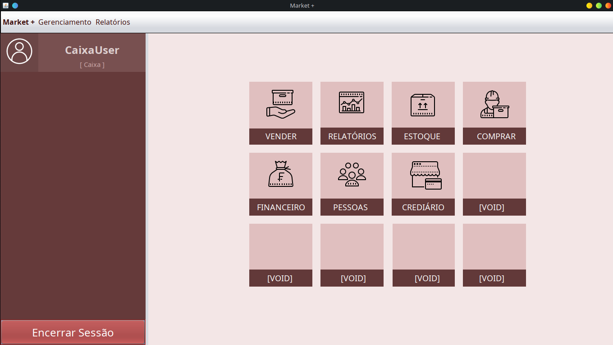
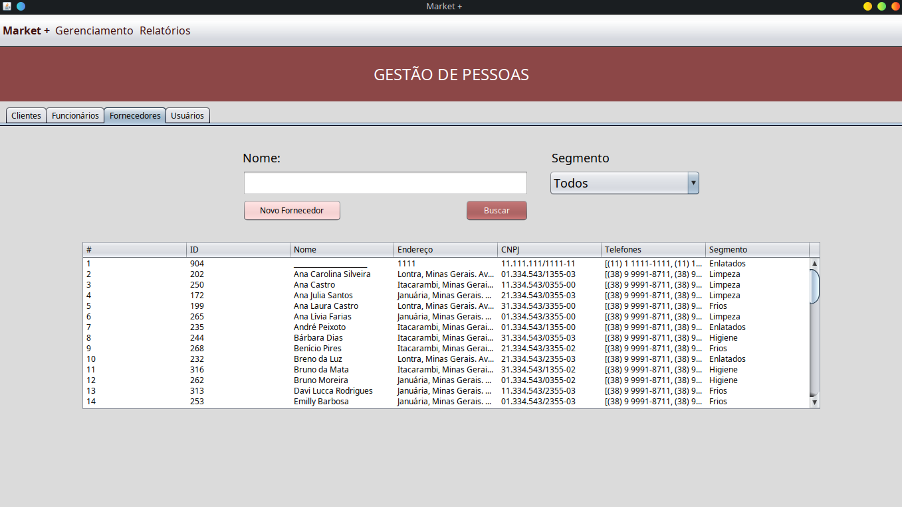

# Sistema Comercial Market-plus
Trabalho final da disciplina: Desenvolvimento de Sistemas Corporativos

### Introdução
O desenvolvimento desse software busca resolver alguns problemas relacionados aos processos de negócio de uma empresa fictícia (Market+). Os problemas são:  controle de estoque, fornecedores, vendas, compras, pessoas e emissão de relatórios.
### Tecnologias
- Java 16
	1. Java Swing
	2. JPA
- Mysql

### Criando o Ambiente de Desenvolvimento
Será necessário ter as tecnologias mencionadas acima instaladas.

### Aprendizado
- (Muito) GIT
- GIT Flow
- Trabalho em Equipe
- Aperfeiçoamento da lógica
- Modelagem
- Prototipação de interfaces

## Capturas
### Tela Principal

### Tela de Login
]
### Tela de Gerenciamento de pessoas

### Tela de Gestão de Estoque

